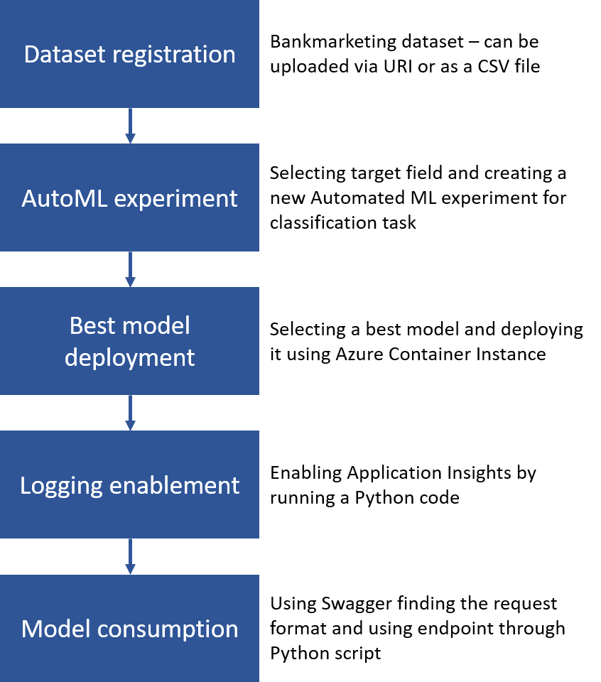
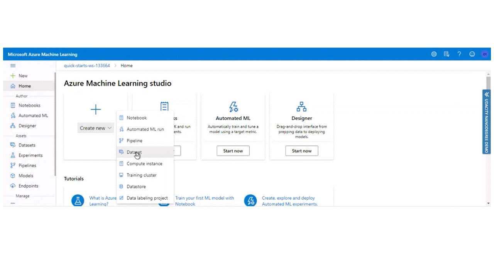
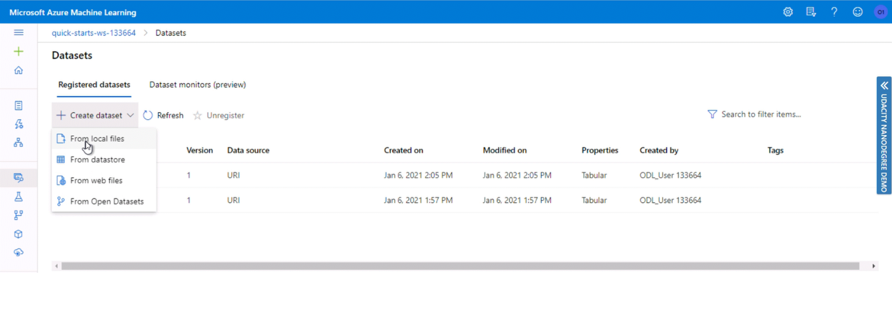
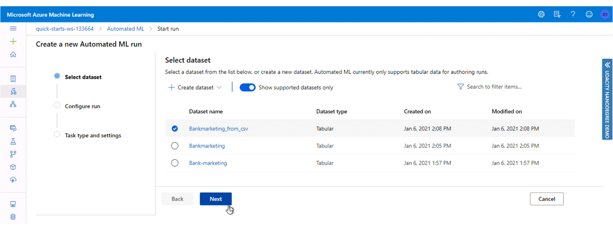
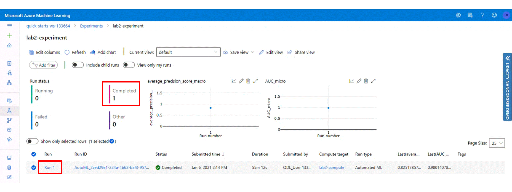
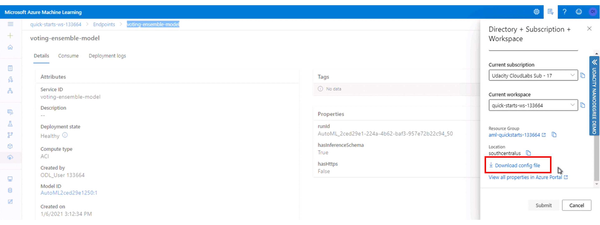
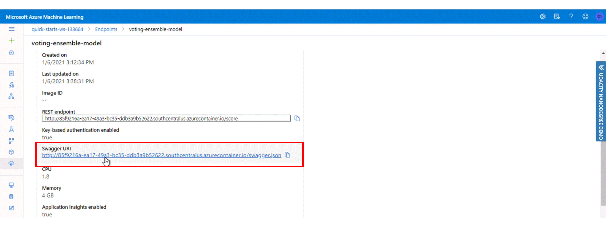

# Operationalizing Machine Learning

This is the second project from the Machine Learning Engineer with Microsoft Azure Nanodegree program. In this project we will run an Auto ML on Bankmarketing dataset. This dataset can be found here: https://automlsamplenotebookdata.blob.core.windows.net/automl-sample-notebook-data/bankmarketing_train.csv

This is a sample dataset provided by Microsoft. According to their documentation, the y column indicates if a customer subscribed to a fixed term deposit. The dataset contains information about customers - their job, marital status, education, loan, etc.
This is a classification problem, where we tried to predict whether a customer is subscribed to a fixed-term deposit, or not. Therefore, later on, when we start an Automated ML experiment, **"y"** will be our target field. 

## Architectural Diagram
The whole project can be depicted as following:

  

We will go through each step in a higher level of detail, staring with the basics. 

## Key Steps

### Step 1: Dataset registration
As the first option, we can register a dataset from URI link. The gif below shows all steps. 

Alternatively, we can upload data from the local csv file. In this case, the file will be stored in an Azure Blob Storage.

Now we can use this data for our Automated ML analysis.

### Step 2: AutoML experiment

### Step 3: Best model deployment

### Step 4: Logging enablement

### Step 5: Model consumption

## Creating, Publishing and Consuming a Pipeline

## Screen Recording
The whole project is summarized in the following short video. 

  

## Standout Suggestions
*TODO (Optional):* This is where you can provide information about any standout suggestions that you have attempted.
