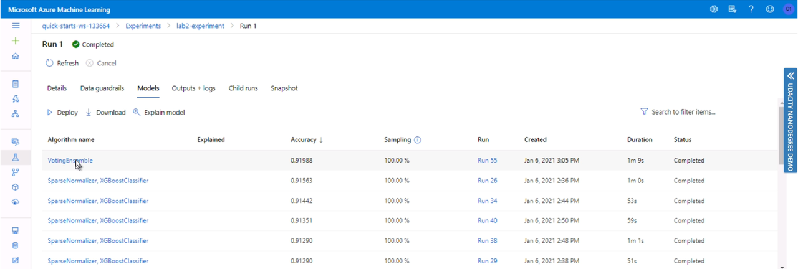
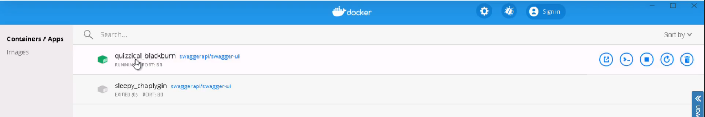
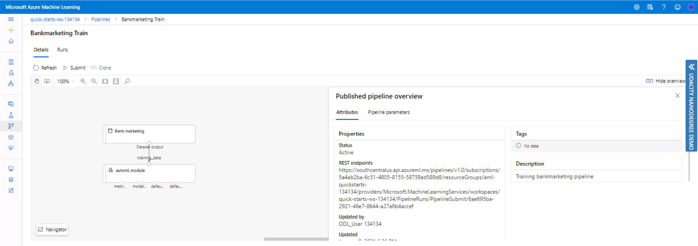

# Operationalizing Machine Learning

This is the second project from the Machine Learning Engineer with Microsoft Azure Nanodegree program. In this project we will run an Auto ML on Bankmarketing dataset. This dataset can be found here: https://automlsamplenotebookdata.blob.core.windows.net/automl-sample-notebook-data/bankmarketing_train.csv

This is a sample dataset provided by Microsoft. According to their documentation, the y column indicates if a customer subscribed to a fixed term deposit. The dataset contains information about customers - their job, marital status, education, loan, etc. This is a classification problem, where we tried to predict whether a customer is subscribed to a fixed-term deposit, or not. Therefore, later on, when we start an Automated ML experiment, **"y"** will be our target field. 

## Architectural Diagram
The whole project can be depicted as following:

  

We will go through each step in a higher level of detail, staring with the basics. 

## Key Steps

### Step 1: Dataset registration
As the first option, we can register a dataset from URI link. The gif below shows all steps. In the configurations we need to provide a link, give a meaningful name and select the column headers. Azure ML studio detects the datatypes of all fields, and as we can see it has determined them correctly.

<!---  -->
Alternatively, we can upload data from the local csv file. In this case, the file will be stored in an Azure Blob Storage. We browse the csv file from local computer, and also select the column headers. 

<!---  -->
Now we can see that the dataset has been added, and we can use this data for our Automated ML analysis.

### Step 2: AutoML experiment

Navigating to the AutoML menu, we have three steps to complete. The first step is selecting the dataset - we select the one we have created. 

Clicking on the "Next", we land to the "Configure run" menu. Here we provide a new experiment name, define target column and create a new compute, since we haven't done it yet. 
For the compute cluster we leave the virtual machine type as it is and choose a virtual machine size. To see all sizes, we click on "Select from all options" and type in the machine name we are interested in. In this case it's Standard_DS12_v2.

By clicking "Next" we move to the next menu, where we have to give a compute name and minimum number of nodes. For this lab it's set up to 1. 
This way we are moving to the last step for our Auto ML configurations, which is selecting task type and settings. Here we select the Classification task and change the additional configuration settings. We set the training job time to one hour, and maximum concurrent iterations to five. By clicking on "Finish" we create a new Auto ML run.
<!---  -->

After it's created, we need to wait till the run gets finished. 

  

### Step 3: Best model deployment
Now, as we can see, the run is completed. If we click on it, we will see further details. The best model summary tells us that VotingEnsemble is the best performing model with accuracy of 91.988%. If we choose this model, we can deploy it. To deploy a model, we need to define name, select a compute type and enable authentication. For this lab we select Azure Container Instance. 

This will create a new child run, and as soon as it's complete, we will see the deploy status as "Succeeded". This creates an endpoint. 
<!---  -->

### Step 4: Logging enablement
Since we have enabled authentication, the endpoint will be now accessed though a key. For this we need to download a config file and ensure it is stored in the folder with other scripts. Now we move to the Git Bash and log into the Azure. az login will initiate a new window, asking for credentials. After login has succeeded, we add to the logs.py a function to enable application insight, and run the script. 

Upon execurtion we will see that the endpoint configuration has changed - application insights is now enabled. 
<!---  -->

### Step 5: Model consumption
Model consumption is now possible. But in order to send requests, we need to know what the request look like. For this we can check swagger. The swagger.json file has to be downloaded and stored together with other swagger files. After executing swagger.sh and serve.py scripts, we can see an example of data request for our endpoint. 

In the endpoint.py script we then put the URI of the endpoint and the key. Alternatively it can be a token. The endpoint.py contains two different data requests. Upon execution, we receive a result for both requests. 
<!---  -->

## Creating, Publishing and Consuming a Pipeline
The whole described process can be published as a pipeline by means of Jupyter Notebook. The whole notebook with all executed cells can be found here: https://github.com/MariiaDen/Operationalizing_Machine_Learning/blob/master/starter_files/aml-pipelines-with-automated-machine-learning-step.ipynb

Upon execution we can see that the pipeline has been created. 
<!---  -->

If you open a Jupyter Notebook, you will be able to see more run details from widget.

If we check our experiments, we will see two completed runs. The run 59 has a tag, which lists the pipeline it comes from. We can also see the automl_module details, where we find out that the VotingEnsemble is the best performing model. 
<!---  -->

After recreating the pipeline experiment part (therefore it is called Run 1), the following pipeline screenshots were taken: 
**REST endpoint active**

**Pipeline runs**

**Pipeline run overview**

**Published pipeline overview**

**Pipeline endpoints**

## Screen Recording
The whole project is summarized in the following short video (please click on the image below). 
<!--- 

  

 -->

  

## Future improvements
As can be seen from the data analysis, the dataset contains a lot of outliers, which strongly influence the model performance. Therefore, data cleaning by removing these outliers could help us to reach better score.

