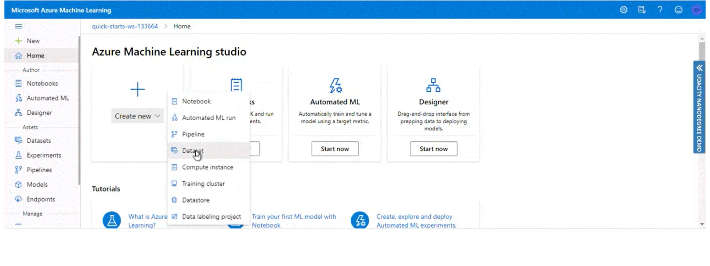

# Operationalizing Machine Learning

This is the second project from the Machine Learning Engineer with Microsoft Azure Nanodegree program. In this project we will run an Auto ML on Bankmarketing dataset. This dataset can be found here: https://automlsamplenotebookdata.blob.core.windows.net/automl-sample-notebook-data/bankmarketing_train.csv

This is a sample dataset provided by Microsoft. According to their documentation, the y column indicates if a customer subscribed to a fixed term deposit. The dataset contains information about customers - their job, marital status, education, loan, etc.
This is a classification problem, where we tried to predict whether a customer is subscribed to a fixed-term deposit, or not. Therefore, later on, when we start an Automated ML experiment, **"y"** will be our target field. 

## Architectural Diagram
The whole project can be depicted as following:

  

We will go through each step in a higher level of detail, staring with the basics. 

## Key Steps

### Step 1: Dataset registration
As the first option, we can register a dataset from URI link. The gif below shows all steps. 
In the configurations we need to provide a link, give a meaningful name and select the column headers. 
Azure ML studio detects the datatypes of all fields, and as we can see it has determined them correctly.

Alternatively, we can upload data from the local csv file. In this case, the file will be stored in an Azure Blob Storage.
We browse the csv file from local computer, and also select the column headers. 

Now we can see that the dataset has been added, and we can use this data for our Automated ML analysis.

### Step 2: AutoML experiment

Navigating to the AutoML menu, we have three steps to complete. The first step is selecting the dataset - we select the one we have created. 
Clicking on the "Next", we land to the "Configure run" menu. Here we provide a new experiment name, define target column and create a new compute, since we haven't done it yet. 
For the compute cluster we leave the virtual machine type as it is and choose a virtual machine size. To see all sizes, we click on "Select from all options" and type in the machine name we are interested in. In this case it's Standard_DS12_v2.
By clicking "Next" we move to the next menu, where we have to give a compute name and minimum number of nodes. For this lab it's set up to 1. 
This way we are moving to the last step for our Auto ML configurations, which is selecting task type and settings. Here we select the Classification task and change the additional configuration settings. We set the training job time to one hour, and maximum concurrent iterations to five. By clicking on "Finish" we create a new Auto ML run.

After it's created, we need to wait till the run gets finished. 

  

### Step 3: Best model deployment

### Step 4: Logging enablement

### Step 5: Model consumption

## Creating, Publishing and Consuming a Pipeline

## Screen Recording
The whole project is summarized in the following short video. 

  

